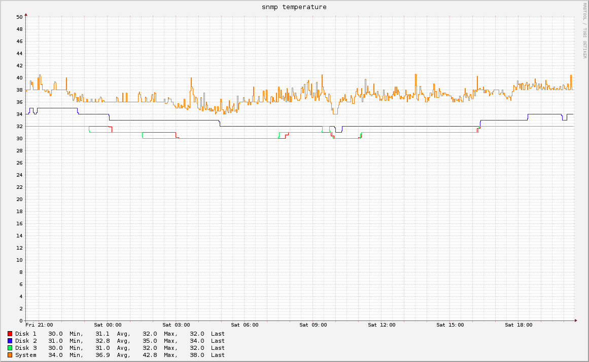

# collectd-synology

This bundle retrieves data from Synology NAS with SNMP.

MIB files are described by Synology in the [MIB Guide](https://global.download.synology.com/download/Document/MIBGuide/Synology_DiskStation_MIB_Guide.pdf).
The actual [MIB files](http://dedl.synology.com/download/Document/MIBGuide/Synology_MIB_File.zip) are managed by this bundle and can be found within `files/mibs`.

## Requirements

* Bundles:
  * [collectd](https://github.com/rullmann/bundlewrap-collectd)
  * [dnf](https://github.com/rullmann/bundlewrap-dnf)

## Metadata

    'metadata': {
        'collectd': {
			synology: {
                'ip': '127.0.0.1' # required
            },
        },
    }

## Example Graphs

